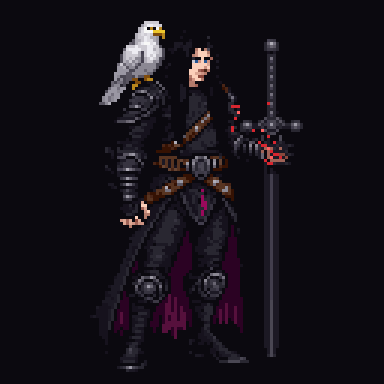
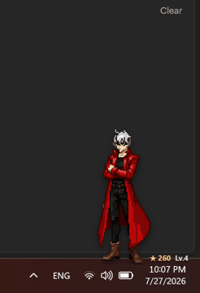
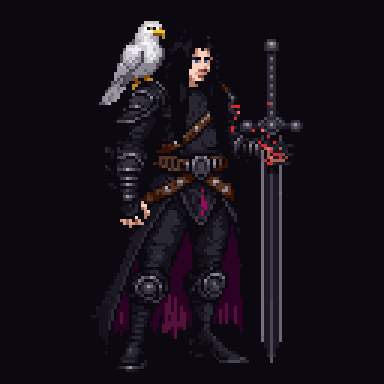
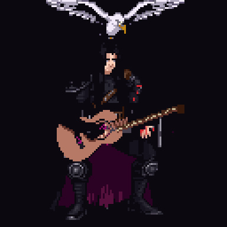
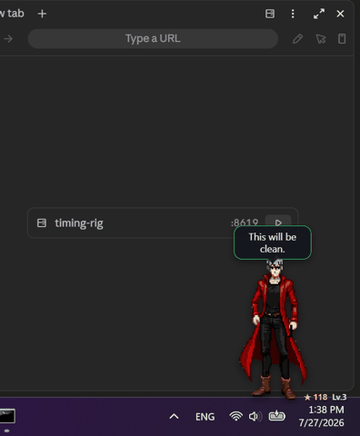
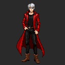

# ECHO — живой пиксельный напарник на твоём рабочем столе

Он стоит у часов и живёт: несёт вахту, пока ты работаешь, дерётся, когда ты играешь, поёт в полночь — а раз в день **правый край твоего монитора раскалывается, и из него лезет демоническая лапа**. Он встретит её с мечом.

**EN:** *A living pixel-art companion for your desktop. He reacts to your work, games and music, remembers you between sessions, learns your rhythm with a fully local "director" — and once a day fights a demon arm that crawls out of your monitor edge. No accounts, no telemetry, one download.*

<p align="center">
  
  
</p>

## Почему он живой

- **Видит твою жизнь за компьютером.** Открыл YouTube, Twitch, Netflix или Spotify — он садится, поворачивается к центру монитора и смотрит вместе с тобой. Запустил игру в Steam — начинается охота. Печатаешь — работает рядом. Работает AI-сессия — твои успехи и провалы становятся его победами и ранами.
- **Помнит тебя.** Звёзды и уровни копятся между запусками. Истории рассказываются с того места, где остановился, и никогда не повторяются.
- **Учится под тебя.** Внутри — локальный «режиссёр»: он замечает, какие сцены тебе заходят, а какие отвлекают, и меняет свои привычки. Без интернета, без нейросетей в рантайме, ~45 МБ памяти.
- **Сцена Двери.** Раз в день край экрана вспыхивает фиолетовым разломом. Лапа продавливает себя наружу. Корвин отступает с мечом-щитом, парирует, вгоняет клинок в землю — и его проклятая левая рука будит в нём получудовище: щупальца тьмы выталкивают лапу обратно. Со звуком: стон камня, рык, лязг стали, удар захлопнувшейся Двери.

## Скачать — один файл, ноль настроек

1. Открой [последний релиз ECHO](https://github.com/icedracon/ECHO/releases/latest).
2. Скачай файл для своей системы.
3. Двойной клик — он сам выйдет к часам и начнёт жить.

| Твоя система | Скачай этот файл | Что делать после загрузки |
|---|---|---|
| Windows 10/11 | `ECHO-Windows-Setup.exe` | Открыть и пройти короткую установку |
| Fedora / RHEL / openSUSE | `ECHO-Fedora-x86_64.rpm` | Открыть через центр программ и нажать «Установить» |
| Ubuntu / Debian / Kali | `ECHO-Debian-x86_64.deb` | Открыть через центр программ и нажать «Установить» |
| Другой Linux | `ECHO-Linux-x86_64.AppImage` | В свойствах файла разрешить запуск как программы, затем открыть |
| Mac с M1/M2/M3/M4 | `ECHO-macOS-Apple-Silicon.dmg` | Открыть образ и перетащить ECHO в Applications |
| Mac на Intel | `ECHO-macOS-Intel.dmg` | Открыть образ и перетащить ECHO в Applications |

Без установки на Windows: `ECHO-Windows-Portable.exe`. А `ECHO-Corvin.exe` и `ECHO-Dante.exe` сразу запускают выбранного героя — навсегда.

> **Система ругается?** ECHO пока не подписан платным сертификатом.
> **Windows:** «Подробнее» → «Выполнить в любом случае». **macOS:** правый клик → «Открыть» → «Открыть» (или System Settings → Privacy & Security → Open Anyway).

## Два героя

### 🦅 Корвин — Страж Двери

Молчаливый полудемон с белым орлом Арцивом на плече. Левая рука — всегда демоническая; он держит её под контролем. Пока ты работаешь, он точит клинок и рассказывает **сто глав своей жизни настоящим голосом** — от сына кузнеца до Стража. Когда ты включаешь видео, он кладёт меч поперёк колен и смотрит в центр экрана вместе с тобой. В полночь садится с гитарой. В 23:40 — молчаливый реквием под ветер. Его горе — письмо, пустая дорога под нескончаемым дождём, могила старого Стража — приходит редко и без предупреждения. А когда Дверь трещит — он единственный, кто стоит между ней и тобой.

<p>
  
  
  
</p>

### 🔴 Данте — охотник

Печатает рядом с тобой на своём ноутбуке, пьёт эспрессо с оттопыренным мизинцем, думскроллит, когда скучно. Включил видео — разворачивается к центру и устраивается смотреть рядом. Запустил игру — Jackpot, огненный меч, Devil Trigger, монетка и пицца по расписанию сессии. Иногда падает с панели задач — и всегда карабкается обратно. Его редкая **полная демон-форма** — крылья, пламя и наглая ухмылка на выходе.

<p>
  
  
</p>

Карта всех таймингов Данте — в [DANTE_TIMINGS.md](DANTE_TIMINGS.md).

## Управление — только мышка

Рядом с часами появится иконка ECHO. Правый клик:

- **Персонаж** — переключить Корвина и Данте без перезапуска;
- **Тихий час** — попросить не отвлекать;
- **Мои песни и постеры** — папка твоих медиа;
- **Как управлять ECHO** — показать подсказку ещё раз.

Горячие клавиши: **Alt+S** — музыкальный момент, **Alt+B** — следующая история Корвина. Кнопок «запустить сцену» в меню нет — он живёт сам. Режим совместного просмотра тоже включается и выключается автоматически: достаточно открыть или закрыть видео.

## Сделай его своим

Меню → **Мои песни и постеры** — папка откроется сама (Windows, Linux, macOS):

| Файл | Для чего |
|---|---|
| `nightsong.mp3` | Ночная песня Корвина и Alt+S |
| `sadsong.mp3` | Реквием Корвина |
| `poster.gif` | Постер Данте |
| `song.mp3` | Трек для сцены с постером |

Положил файл — перезапустил — готово.

## Приватность

Всё локально. ECHO видит только факты: «клавиши нажимаются» (не текст), «открыто окно игры/музыки», активность AI-логов. Ноль сетевых запросов в рантайме, ноль телеметрии. Вся его память — открытым текстом в `~/.echo/`.

<details>
<summary><b>⚙️ Для разработчиков</b></summary>

### Запуск из исходников

```powershell
.\Start ECHO.bat        # Windows (dev-режим: .\Start ECHO.bat dev)
```

```bash
./Start\ ECHO.sh        # Linux
```

### Демо-команды (QA сцен)

```bash
echo door > ~/.echo/demo
```

```powershell
Set-Content "$env:USERPROFILE\.echo\demo" "door"
```

Слова: `corvin`, `dante`, `reel`, `fly`, `tale`, `chapter`, `night`, `requiem`,
`break`, `combo`, `letter`, `road`, `rain`, `cairn`, `execution`, `unchained`,
`cleave`, `vigil`, `guitar`, `hunt`, `scan`, `nuzzle`, `damage`, `parry`,
`ritual`, `door`, `form`, `stone`, `flask`, `devil`, `sword`, `poster`,
`pizza`, `coin`, `spin`, `clean`, `wake`, `watch`, `nightwatch`, `moto`, `ride`.

### Разработка

```bash
npm install
npm run dev
npm run tauri dev
npm run verify   # кадры, тайминги, триггеры, голос, Rust-тесты, release build
```

| Путь | Назначение |
|---|---|
| `src/` | TypeScript: сцены, спрайтовый движок, режиссёр |
| `src/corvin.ts` | Каталог клипов Корвина, ручные msSeq-тайминги |
| `src-tauri/` | Rust: окна, трей, хоткеи, watchers |
| `public/pixel/` | Пиксель-арт кадры |
| `scripts/` | Генерация ассетов |

### Релиз

Workflow `.github/workflows/build-unix.yml` собирает Windows (Setup/MSI/Portable/Corvin/Dante), Linux (AppImage/deb/rpm) и macOS (два .dmg). Запуск: GitHub Actions → **Build Release** → tag `v0.2.4`, или пушем тега `v*`. Перед публикацией — `CHANGELOG.md` и `RELEASE_CHECKLIST.md`.

</details>

## Ночная вахта в 00:40

ECHO сам замечает время, ручной запуск не нужен. В `00:40` активный герой занимает ночной пост:

- **Корвин** садится у камней, откладывает меч, а Арцив устраивается рядом. Через 10 минут Корвин проверяет, работаешь ли ты ещё, и, если да, минуту подбрасывает камешек перед новой дремотой.
- **Данте** стягивает одеяло с края рабочего стола и ложится. Через 10 минут он просыпается, смотрит, не закончил ли ты работу, коротко комментирует и снова отворачивается спать.

Сцена запускается только один раз за ночь, не перебивает уже идущую сцену и после завершения возвращает героя точно на его место у часов.

---

Пиксель-арт создан через [PixelLab](https://pixellab.ai). Данте — фанатский трибьют; Корвин и Арцив — оригинальные персонажи ECHO. Ночная песня используется с разрешения автора.
