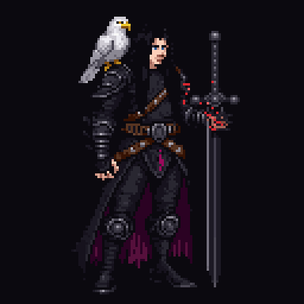
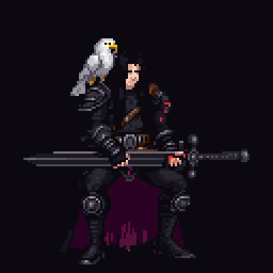
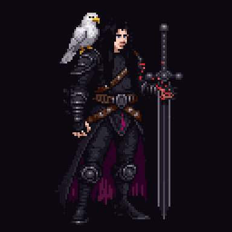
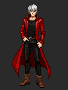
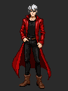
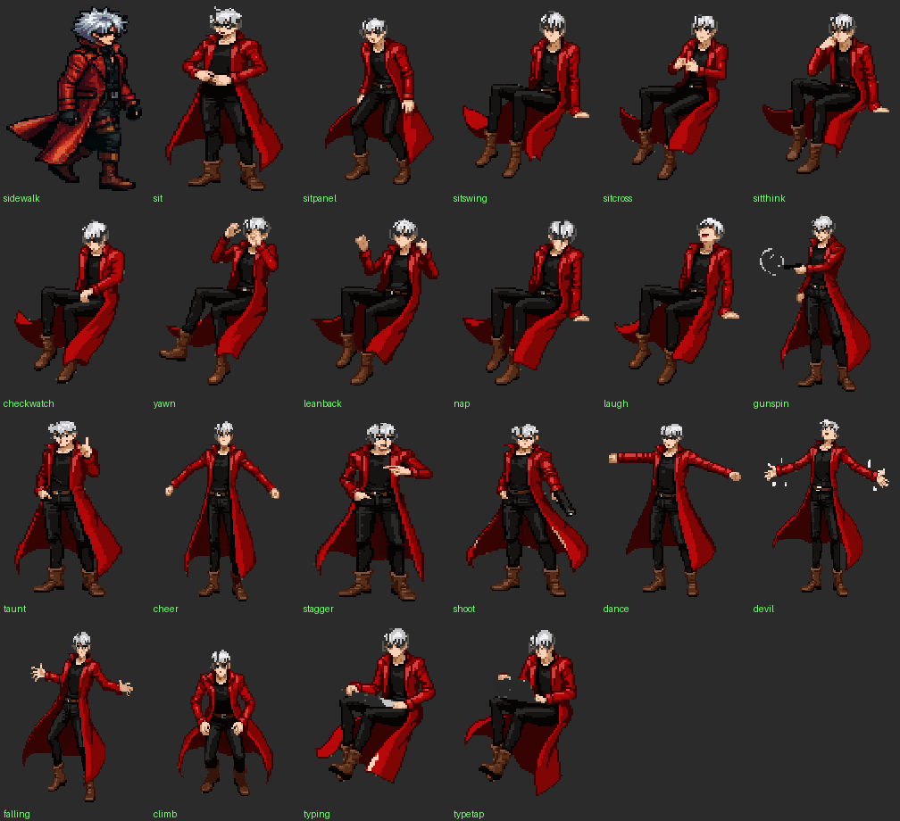

# ECHO — a pixel-art companion for your taskbar

A lightweight **Tauri v2** desktop pet that lives on the Windows taskbar and
reacts in real time to what you're doing — your AI coding session, your typing,
your music, your games. Always-on-top, click-through, ~30–45 MB RAM.

**Two characters ship in one app.** Download the hero you want:

| Build | Who walks in |
|---|---|
| 🦅 **`Echo-Corvin.exe`** | **Corvin, the Sentinel** — a silent warden with a white eagle, a greatsword and six hundred years of stories |
| 🔴 **`Echo-Dante.exe`** | **Dante** — the devil hunter: Jackpot, Devil Trigger, fire sword, poster dances |
| ⚪ **`ECHO.exe`** | Both — switch live with `echo corvin > ~/.echo/demo` / `echo dante > ~/.echo/demo` |

One character on screen at a time; a second launch just exits.

<p align="center">
  
  
</p>

---

# 🦅 Corvin, the Sentinel

He doesn't chatter. He stands his watch beside your work, and when he speaks it
is to tell you something he remembers.

### The watch
His coat moves in the wind. Every half-minute he shifts — scanning the horizon,
sitting to meditate, sharpening the blade. Every minute or two he does something
larger: a story, the shadow aura, a bow, a perimeter scan, or he lets the eagle go.

<p>
  
  
</p>

### Artsiv flies your whole screen
The eagle launches off his shoulder into a transparent, click-through window the
size of your monitor, sweeps two grand laps over all your windows, and lands back.
Your clicks pass straight through him.


### He tells you his life
Voiced (deep male system voice) over the eagle-nuzzle loop, uninterruptible until
the last word:

- **Tales** — the eagle, the castle, the last hunt, the hard years, the arm.
  Six arcs, told fragment by fragment. He *never repeats himself* and always
  continues where he stopped — the pointers live in `~/.echo/story.json`.
- **The Warden's Novel** — type for 7+ minutes and he begins the next of
  **100 chapters** in five books: how a smith's son became the warden of a Door
  nobody built, the hundred years after, the world outgrowing him, the secret of
  the Seals, and a confession. Strictly in order, one chapter at a time.
- **The midnight ritual** — at 00:00 he plays guitar to your own song
  (`~/.echo/media/nightsong.mp3`) and tells one fragment of the story he says he
  cannot tell. Press **ALT+S** to ask for it any time.


### He answers your session in steel
| What happens | What he does |
|---|---|
| 3 wins in a row | **Execution** — a slow raise, a held breath, one devastating cut |
| Level up | **Unchained** — the blade runs crimson, a tower of shadow rises behind him |
| Error streak | **The vigil** — he takes a knee, the eagle joins him on the sword |
| A single error | **He takes the hit** — the demon arm flares, he never falls |
| 25★ milestone | Artsiv preens his hair. Rare approval. |

<p>
  
  
  
</p>

### Steam is the hunt
Launching a game opens a perimeter scan. Then the schedule runs from the real
game launch: **Unchained at 3:00**, the **great cleave at 7:00**, each every
10 minutes after — plus an hourly trophy and an eagle patrol.

<p>
  
  
</p>

---

# 🔴 Dante

### He types when you type
Real keystrokes only (mouse doesn't count). He pulls a laptop onto his knees,
taps along in bursts, and shoves it away ~9 s after you stop.


### He celebrates your music — плакат style
Open YouTube / Spotify / Twitch and he stands, raises both arms and holds a poster
overhead with your GIF playing on it while your song plays — 15 seconds, then back
to work, repeating every ~10 minutes while the music stays on.


### He fights when you game
Every beat is anchored to the real game launch (Steam registry or a fullscreen
foreground — windowed games count):

| Time into the game | Beat |
|---|---|
| 0:00 | 3-shot gold Jackpot burst |
| 3:00, then every 10 min | **Devil Trigger** with a monster-voice "JACKPOT!" |
| 6:00, then every 20 min | fiery sword spin |
| 7:00, then every 10 min | the **full sword move** |
| +3 h / +3.5 h | coin flip / pizza |

Your keys and mouse are gameplay — the laptop never appears mid-game.

<p>
  
  
</p>

### He dances
Star milestones and media moments trigger the classic moves or the fist-pump
headbang (a seamless loop, the hit lands on the beat):

<p>
  
  
</p>



---

## Shared engine

### He reacts to your AI session
Tails your AI coding activity locally:

| Source | Path | Mode |
|---|---|---|
| **Claude Code** | `~/.claude/projects/**/*.jsonl` | parsed → rich states |
| **Cursor** | `%APPDATA%/Cursor/User/workspaceStorage` | activity pulse |
| **Claude Desktop** | `%APPDATA%/Claude` | activity pulse |

Rapid events are debounced; big scenes are rate-limited (≥3 min apart, daily
budgets) so they stay special.

### He has a life
A persistent 7-stat mood vector (energy, confidence, patience, focus, curiosity,
cockiness, boredom) drifts with time and events, survives restarts, and tilts his
idle choices. After 10 minutes of silence he walks off screen and wanders back on
his own — or the moment you need him.

Memory lives in `~/.echo/story.json`: your tenure together, day-by-day stats,
once-ever firsts, long-running gags, and every story pointer.

### He sounds right
Synthesized in-engine (no audio assets): gunshots, thuds, blade whooshes timed to
each slash, fire ignite and ember fizz, a demonic roar — and Dante's Devil Trigger
runs your "Jackpot!" clip through a live demon chain (pitch-down layers +
distortion + cavern echo). Corvin's stories use the system voice, pitched deep.

---

## Install & run

**Easiest:** grab your hero's exe from [Releases](../../releases) and run it.

**From a clone:** double-click **`Start ECHO.bat`** — it finds or downloads a
prebuilt exe, seeds your media folder, launches the pet and closes itself.
Developers: `Start ECHO.bat dev`.

**Linux:** `./Start\ ECHO.sh` (builds from source). On Fedora/GNOME pick
**"GNOME on Xorg"** at login — Wayland doesn't let apps position their own
windows. Context awareness (typing/media/gaming) is Windows-only for now.

## Make him yours

Everything lives in `~/.echo/` — swap files, restart, no rebuild:

| File | What it changes |
|---|---|
| `~/.echo/character` | `corvin` or `dante` (plain `ECHO.exe` only) |
| `~/.echo/media/nightsong.mp3` | Corvin's midnight song (**ALT+S**) |
| `~/.echo/media/poster.gif` | the GIF on Dante's плакат |
| `~/.echo/media/song.mp3` | the song he plays with it |
| `~/.echo/voice/<slug>.mp3` | any spoken Dante line (46 slugs, e.g. `jackpot.mp3`) |

**Play any scene on demand** — write a word to `~/.echo/demo`:

```bash
echo corvin > ~/.echo/demo      # switch to the Sentinel (dante switches back)
echo reel > ~/.echo/demo        # his full showcase
echo fly > ~/.echo/demo         # Artsiv across the screen
echo tale > ~/.echo/demo        # a voiced tale
echo chapter > ~/.echo/demo     # the next novel chapter
echo night > ~/.echo/demo       # the midnight ritual
echo sword > ~/.echo/demo       # Dante's full sword move
echo devil > ~/.echo/demo       # Devil Trigger + monster JACKPOT
```

Also: `execution`, `unchained`, `cleave`, `vigil`, `guitar`, `hunt`, `scan`,
`nuzzle`, `damage`, `poster`, `pizza`, `coin`, `spin`, `clean`, `wake`.

## Architecture

- **Rust backend** (`src-tauri/src/`): `watcher.rs` tails the AI sources,
  `events.rs` classifies each JSONL line, `context.rs` watches typing / media /
  gaming / the ALT+S hotkey (Win32), `lib.rs` persists stars, story and the
  character choice (the exe's own filename locks the hero for the named builds).
- **Frontend** (`src/main.ts`): a pixel sprite player with per-frame timing
  (`msSeq`), a weighted never-repeat idle planner driven by the mood vector, and
  OS-window choreography for walk-ins, scenes, the poster and the full-screen sky.
  `corvin.ts` is the Sentinel's clip catalogue, `tales.ts` and `novel.ts` his words.
- Every decision is logged to **`~/.echo/echo.log`** and `~/.echo/echo-fe.log`, so
  any behaviour is explainable after the fact.

## Docs

`DESIGN.md` — the behaviour spec and roadmap · `MOVES.md` — every move with its
trigger and tuning knob · `SESSION_SUMMARY.md` — dev handoff notes.

---

Art generated with [PixelLab](https://pixellab.ai) from a single canon reference
per character. Dante is a fan tribute to *Devil May Cry* (Capcom); Corvin and
Artsiv are original characters.
